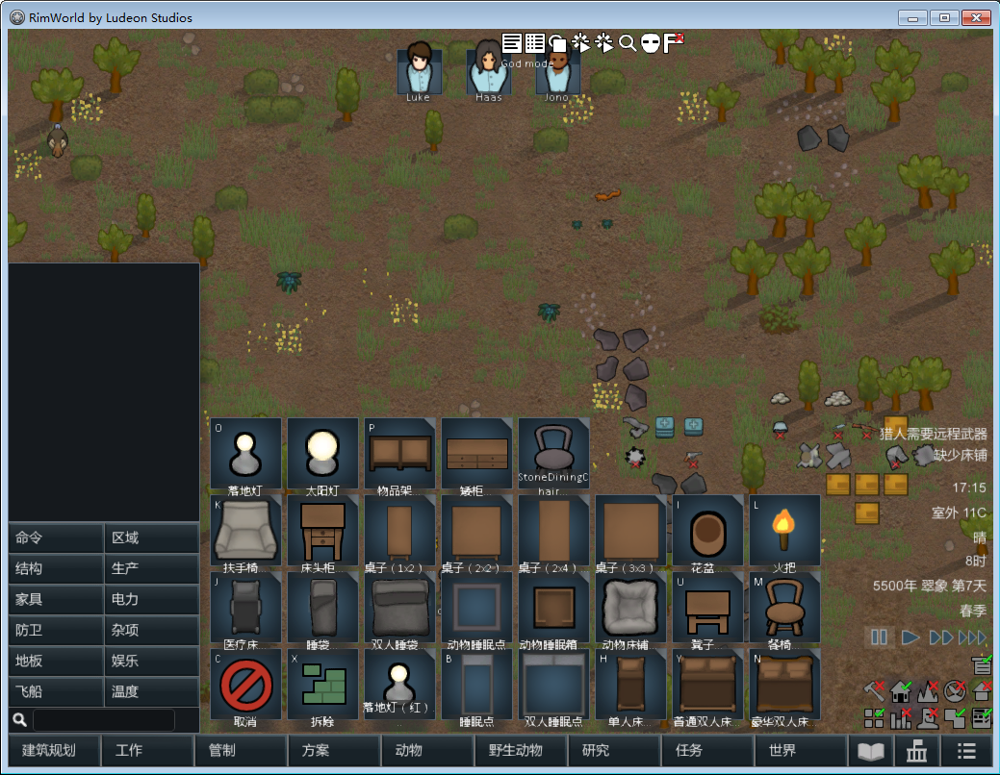
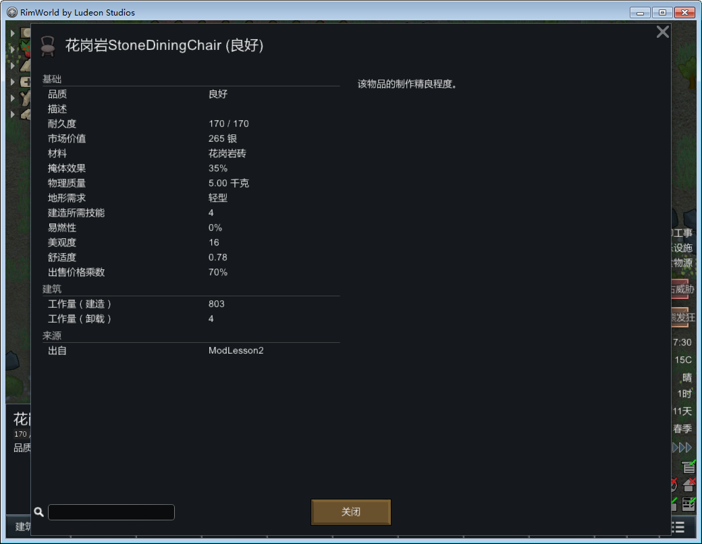

# Rimoworld的mod教程第三篇

这是Rimworld的Mod教程第三篇，主要目的是通过阅读原版的XML文件制作单人餐桌Mod。


1. 首先按照Lesson1的步骤制作一个基础的Mod.
2. 然后打开Rimworld主目录下的 \Data\Core\Defs\ThingDefs_Buildings子目录。
3. 使用编辑器打开Builds_Furniture.xml,对字符串Chair进行查找。
4. 我们将DiningChair对应的XML数据拷贝出来。
```XML
<ThingDef ParentName="ArtableFurnitureBase">
    <defName>DiningChair</defName>
    <label>dining chair</label>
    <description>A comfortable and attractive chair. Can be used at tables, work stations, and elsewhere.</description>
    <graphicData>
      <texPath>Things/Building/Furniture/DiningChair</texPath>
      <graphicClass>Graphic_Multi</graphicClass>
      <drawSize>(1,1)</drawSize>
      <damageData>
        <rectN>(0.25,0.234375,0.5,0.28125)</rectN>
        <rectS>(0.25,0.234375,0.5,0.28125)</rectS>
        <rectE>(0.28125,0.25,0.453125,0.25)</rectE>
        <rectW>(0.28125,0.25,0.453125,0.25)</rectW>
      </damageData>
      <shadowData>
        <volume>(0.23, 0.26, 0.23)</volume>
      </shadowData>
    </graphicData>
    <altitudeLayer>Building</altitudeLayer>
    <statBases>
      <MaxHitPoints>100</MaxHitPoints>
      <WorkToBuild>8000</WorkToBuild>
      <Mass>5</Mass>
      <Flammability>1.0</Flammability>
      <Beauty>8</Beauty>
      <Comfort>0.70</Comfort>
      <StyleDominance MayRequire="Ludeon.RimWorld.Ideology">5</StyleDominance>
    </statBases>
    <socialPropernessMatters>true</socialPropernessMatters>
    <stuffCategories>
      <li>Metallic</li>
      <li>Woody</li>
    </stuffCategories>
    <costStuffCount>45</costStuffCount>
    <pathCost>30</pathCost>
    <designationHotKey>Misc7</designationHotKey>
    <fillPercent>0.35</fillPercent>
    <defaultPlacingRot>South</defaultPlacingRot>
    <building>
      <isSittable>true</isSittable>
    </building>
    <constructionSkillPrerequisite>4</constructionSkillPrerequisite>
    <researchPrerequisites>
      <li>ComplexFurniture</li>
    </researchPrerequisites>
    <comps>
      <li Class="CompProperties_Styleable" />
    </comps>
  </ThingDef>
```
5. 此时我们发现该节点下有stuffCategories节点，其中的数据就是餐椅的材质。
6. 而通过与Stool的stuffCategories的节点进行对比,差异的材质就是Stony。
7. 因此我们编写出StoneArmChair对应的XML文件为
```xml
<?xml version="1.0" encoding="utf-8" ?>
<Defs>
<ThingDef ParentName="ArtableFurnitureBase">
    <defName>StoneDiningChair</defName>
    <label>StoneDiningChair</label>
    <description>A comfortable and attractive chair. Can be used at tables, work stations, and elsewhere.</description>
    <graphicData>
      <texPath>Things/Building/Furniture/DiningChair</texPath>
      <graphicClass>Graphic_Multi</graphicClass>
      <drawSize>(1,1)</drawSize>
      <damageData>
        <rectN>(0.25,0.234375,0.5,0.28125)</rectN>
        <rectS>(0.25,0.234375,0.5,0.28125)</rectS>
        <rectE>(0.28125,0.25,0.453125,0.25)</rectE>
        <rectW>(0.28125,0.25,0.453125,0.25)</rectW>
      </damageData>
      <shadowData>
        <volume>(0.23, 0.26, 0.23)</volume>
      </shadowData>
    </graphicData>
    <altitudeLayer>Building</altitudeLayer>
    <statBases>
      <MaxHitPoints>100</MaxHitPoints>
      <WorkToBuild>8000</WorkToBuild>
      <Mass>5</Mass>
      <Flammability>1.0</Flammability>
      <Beauty>8</Beauty>
      <Comfort>0.70</Comfort>
      <StyleDominance MayRequire="Ludeon.RimWorld.Ideology">5</StyleDominance>
    </statBases>
    <socialPropernessMatters>true</socialPropernessMatters>
    <stuffCategories>
      <li>Stony</li>
    </stuffCategories>
    <costStuffCount>45</costStuffCount>
    <pathCost>30</pathCost>
    <designationHotKey>Misc7</designationHotKey>
    <fillPercent>0.35</fillPercent>
    <defaultPlacingRot>South</defaultPlacingRot>
    <building>
      <isSittable>true</isSittable>
    </building>
    <constructionSkillPrerequisite>4</constructionSkillPrerequisite>
    <researchPrerequisites>
      <li>ComplexFurniture</li>
    </researchPrerequisites>
    <comps>
      <li Class="CompProperties_Styleable" />
    </comps>
  </ThingDef>
</Defs>
```

我们将编写好的XML文件放入ModLesson2目录下的Defs目录下，命名为Buildings_StoneArmChair.xml.
8. 我们看看在实际使用中的效果。

