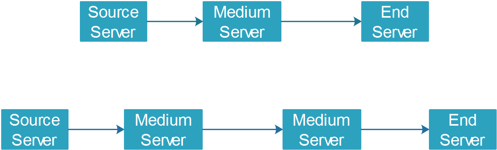

# cppNetMsgFrame
一个基于asio的网络消息模型，支持C++11 Windows,Mac OS,Linux 三个操作系统。


##  1.  编译器支持情况
|操作系统|编译器|
|-------|-----|
|Win7的64位版本|VS2017社区版|
|Ubuntu 18.04 |g++ 7.3.0|
|Mac OS 10.14.1 |Apple LLVM version 10.0.0 (clang-1000.10.44.4)|


## 2. 编译方式
编译的方式需要使用CMake的3.0以上的版本

### 2.1 Ubuntu编译
在Code目录，执行以下的命令

```
mdkir Build
cd Build
cmake ..
make
```

### 2.2 Windows编译


### 2.3 Mac编译


## 3. 使用的库

### 3.1 日志库
对于日志，我们使用的是spdlog，在Github的链接如下

[spdlog](https://github.com/gabime/spdlog)

### 3.2 网络库
我们使用的是asio，这个asio是不依赖于boost的1.12.2版本。

[asio](https://think-async.com/Asio/)

### 3.3 json库
我们的Json库使用的是json11的这个库

[json11](https://github.com/dropbox/json11)

### 3.4 单元测试库
单元测试使用的是doctest
[doctest](https://github.com/onqtam/doctest)

## 4. 三个程序的简介

### 4.1 SourceServer
这个程序是用来作为客户端，连接到服务器的。

### 4.2 MediumServer
这个程序是用来作为中继的，它同时作为客户端和服务器端，来实现消息的中继。

### 4.3 EndServer
这个程序是用来作为服务器的，用来接受客户端的连接。

## 5.消息处理相关

### 5.1 消息格式定义
消息格式的定义在 `include/common/CommonMsg.h`中。
我们主要使用
1. `struct TransBaseMsg_t`来传输消息
2. 用`BaseMsg`这样的类型来处理消息，
3. 对于每条消息，有一个`消息ID`,需要在`enum class MessageType:uint32_t`进行定义，
4. 在每个消息的构造函数中，赋值到`BaseMsg`的对应变量。
   
### 5.2 新增一条消息的步骤
1. 在`enum class MessageType:uint32_t`中为该消息定义`ID`。
2. 从`BaseMsg`继承，并实现`virtual std::string ToString() const`和`virtual bool FromString(const std::string& strJson)`两个接口。
3. 在需要发送的地方，给Msg的具体字段赋值，并生成`struct TransBaseMsg_t`类型的`shared_ptr`类型的变量，具体可以参考对于心跳请求消息`KeepAliveRspMsg`的处理。
4. 在接收消息的地方编写处理消息的函数，具体可以看到`KeepAliveRspMsg`的处理，然后在`handle_message`中调用。

## 6. 支持的模型

### 6.1 最简单的模型

### 6.2 一般的模型

### 6.3 复杂的模型


## 7. 后续完善
### 7.1 消息压缩
目前的消息处理是不压缩的，所以消息转字符串以后，会变得比较大，导致传输成本上升。


### 7.2 代码完善